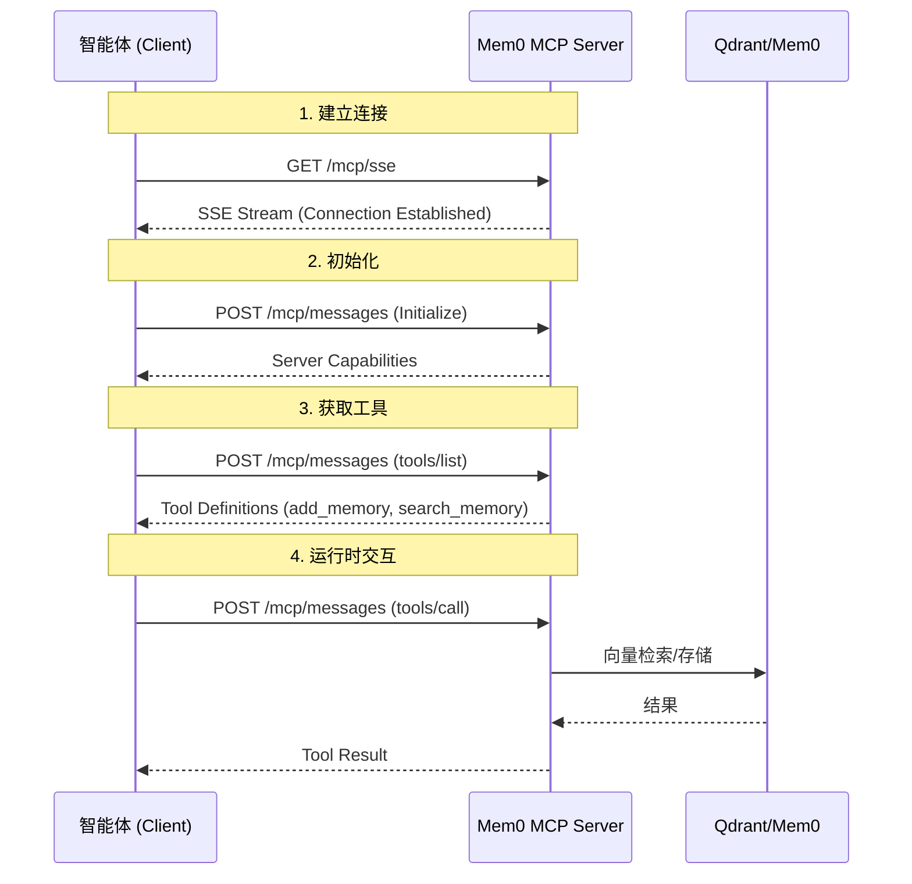

# Mem0 MCP Server 集成指南

本指南旨在帮助开发者和智能体（Agent）构建者将 Mem0 长期记忆服务集成到他们的系统中。本服务遵循 [Model Context Protocol (MCP)](https://modelcontextprotocol.io/) 标准，通过 HTTP SSE (Server-Sent Events) 提供传输层。

## 1. 架构概览

Mem0 MCP Server 作为一个独立的记忆服务运行，智能体通过标准的 MCP 协议与其交互。



## 2. 连接信息

* **Base URL**: `http://localhost:8001` (默认)
* **SSE Endpoint**: `GET /mcp/sse`
  * 用于接收服务器推送的事件（如连接建立、日志、通知）。
* **Message Endpoint**: `POST /mcp/messages`
  * 用于发送所有的 JSON-RPC 2.0 请求（初始化、列出工具、调用工具）。

## 3. 核心工具定义

智能体应配置以下两个核心工具。

### 3.1 add_memory (添加记忆)

用于将对话中的关键信息、用户偏好、事实数据存储到长期记忆中。

* **适用场景**: 用户陈述了新的事实、改变了偏好、提供了背景信息。
* **多语言**: 支持任意语言输入，服务器会自动检测并处理。
* **隔离策略**: 使用 `device_uuid` 进行物理设备隔离，可选 `voiceprint_id` 区分同一设备上的不同用户。

**Schema (JSON)**:

```json
{
  "name": "add_memory",
  "description": "Add new memories from conversation messages. Automatically detects language and stores memories in their original language.",
  "inputSchema": {
    "type": "object",
    "properties": {
      "messages": {
        "type": "array",
        "description": "Array of conversation messages to extract facts from.",
        "items": {
          "type": "object",
          "properties": {
            "role": { "type": "string", "enum": ["user", "assistant"] },
            "content": { "type": "string" }
          },
          "required": ["role", "content"]
        }
      },
      "device_uuid": {
        "type": "string",
        "description": "REQUIRED. Unique identifier for the device. Used for memory isolation."
      },
      "voiceprint_id": {
        "type": "string",
        "description": "Optional. Unique identifier for the speaker (voiceprint) to distinguish users on the same device."
      },
      "metadata": {
        "type": "object",
        "description": "Optional metadata (e.g., session_id, source)"
      }
    },
    "required": ["messages", "device_uuid"]
  }
}
```

### 3.2 search_memory (搜索记忆)

用于在回答用户问题前，检索相关的历史背景知识。

* **适用场景**: 需要回忆之前的对话、查询用户偏好、回答基于历史信息的问题。
* **跨语言**: 支持跨语言搜索（如用中文搜英文记忆）。
* **过滤**: 支持通过 `voiceprint_id` 过滤特定用户的记忆。

**Schema (JSON)**:

```json
{
  "name": "search_memory",
  "description": "Search for relevant memories based on a query. Returns memories in any language that match the semantic meaning.",
  "inputSchema": {
    "type": "object",
    "properties": {
      "query": {
        "type": "string",
        "description": "Search query string."
      },
      "device_uuid": {
        "type": "string",
        "description": "Device UUID to search within."
      },
      "voiceprint_id": {
        "type": "string",
        "description": "Optional. Filter memories by specific speaker voiceprint ID."
      },
      "limit": {
        "type": "integer",
        "description": "Max number of results (default 10).",
        "default": 10
      }
    },
    "required": ["query", "device_uuid"]
  }
}
```

## 4. 智能体集成指南

为了让智能体有效地使用这些工具，建议在 System Prompt 中包含以下指导原则。

### 4.1 System Prompt 示例

```text
你是一个拥有长期记忆能力的智能助手。你可以通过工具访问用户的历史记忆。

# 记忆工具使用原则

1. **主动检索 (search_memory)**:
   - 在回答用户关于"我"、"之前"、"历史"或特定偏好的问题前，务必先调用 search_memory。
   - 示例: 用户问"我上次提到的那本书叫什么？" -> search_memory(query="书名", device_uuid=..., voiceprint_id=...)

2. **主动记录 (add_memory)**:
   - 当用户提供新的个人信息、偏好、重要事实时，调用 add_memory。
   - 示例: 用户说"我搬到上海了" -> add_memory(messages=[...], device_uuid=..., voiceprint_id=...)
   - 修正记忆: 如果用户更正了之前的说法（如"我不喜欢咖啡了，改喝茶"），直接调用 add_memory 记录新偏好，系统会自动处理。

3. **参数要求**:
   - device_uuid 是必需的，用于设备级隔离。
   - voiceprint_id 是可选的，用于区分同一设备上的不同用户。

4. **多语言处理**:
   - 你可以使用任何语言与工具交互，系统会自动处理语言转换。
```

### 4.2 交互流程示例

#### 场景：用户更改偏好（带声纹ID）

1. **用户**: "我以后早餐不吃面包了，改吃燕麦。" (Device: dev-001, Voice: user-A)
2. **Agent (思考)**: 用户更新了饮食偏好，需要记录。
3. **Agent (调用工具)**:

    ```json
    {
      "name": "add_memory",
      "arguments": {
        "messages": [{"role": "user", "content": "我以后早餐不吃面包了，改吃燕麦。"}],
        "device_uuid": "dev-001",
        "voiceprint_id": "user-A"
      }
    }
    ```

4. **MCP Server**: 提取事实 "早餐偏好改为燕麦"，存储在 dev-001 空间下，标记为 user-A。
5. **Agent (回复)**: "好的，已记下您早餐改吃燕麦了。"

#### 场景：后续查询（带声纹ID）

1. **用户**: "我早餐一般吃什么？" (Device: dev-001, Voice: user-A)
2. **Agent (思考)**: 需要查询用户的早餐偏好。
3. **Agent (调用工具)**:

    ```json
    {
      "name": "search_memory",
      "arguments": {
        "query": "早餐偏好",
        "device_uuid": "dev-001",
        "voiceprint_id": "user-A"
      }
    }
    ```

4. **MCP Server**: 返回 `[{ "memory": "早餐偏好改为燕麦", "metadata": { "voiceprint_id": "user-A" } }]`
5. **Agent (回复)**: "根据您的记录，您现在早餐习惯吃燕麦。"

## 5. 部署与配置

### 5.1 Docker Compose 部署

使用提供的 `docker-compose.mcp-http.yml` 文件一键启动：

```bash
docker-compose -f docker-compose.mcp-http.yml up -d
```

### 5.2 环境变量配置 (.env)

| 变量名               | 描述                    | 默认值/示例                            |
| :------------------- | :---------------------- | :------------------------------------- |
| `QDRANT_HOST`        | Qdrant 向量数据库地址   | `localhost`                            |
| `QDRANT_PORT`        | Qdrant 端口             | `6333`                                 |
| `LLM_PROVIDER`       | 事实提取用的 LLM 提供商 | `openai` (兼容接口)                    |
| `LLM_BASE_URL`       | LLM API Base URL        | `https://open.bigmodel.cn/api/paas/v4` |
| `ZHIPU_API_KEY`      | LLM API Key             | `your_key`                             |
| `EMBEDDING_PROVIDER` | Embedding 提供商        | `openai` (兼容接口)                    |
| `MODELARK_API_KEY`   | Embedding API Key       | `your_key`                             |

## 6. 错误处理

MCP Server 使用标准的 JSON-RPC 错误码，并扩展了自定义错误：

* `-32700`: Parse error (JSON 格式错误)
* `-32600`: Invalid Request (请求结构无效)
* `-32601`: Method not found (方法不存在)
* `-32602`: Invalid params (参数缺失或类型错误)
* `-32603`: Internal error (服务器内部错误)
* `-32001`: Memory Error (Mem0 操作失败)

**常见错误修复**:

* `ValidationError: device_uuid`: 确保 `device_uuid` 是 `arguments` 的直接属性，且不为空。

## 7. 客户端实现参考

如果您需要自己实现 MCP Client，可以参考项目中的 `test_llm_with_mcp_tools.py`。

**Python (httpx) 示例**:

```python
import httpx

MCP_URL = "http://localhost:8001/mcp/messages"

async def call_tool(name, args):
    payload = {
        "jsonrpc": "2.0",
        "id": 1,
        "method": "tools/call",
        "params": {
            "name": name,
            "arguments": args
        }
    }
    async with httpx.AsyncClient() as client:
        resp = await client.post(MCP_URL, json=payload)
        return resp.json()
```
